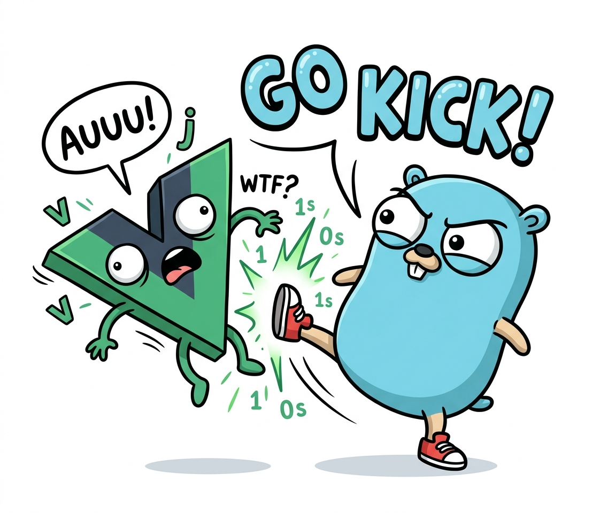

# GO Kick



Golang **DDD** skeleton s **CQRS** (Command Query Responsibility Segregation), Vue 3 SPA, SQLite databází a JWT autentizací – vše v jedné binárce.

- Aplikace: <https://gokick-app.strategio.dev> (user: `admin`, heslo: `admin`)
- Dokumentace: <https://gokick.strategio.dev/>
- GitHub: <https://github.com/jzaplet/gokick>

## Vlastnosti

- **DDD** – čtyřvrstvá architektura (domain → application → infrastructure → presentation) s bounded kontexty, entitami, value objects a domain eventy
- **CQRS** – oddělené command/query/event busy s middleware chain (logging, autorizace, transakce, recovery)
- **Dependency inversion** – doména definuje interfaces (porty), infrastruktura dodává implementace (adaptery). Př: SQLite lze zaměnit za Postgres bez zásahu do domény
- **Vue 3** SPA (Vite, TypeScript, Tailwind) embedovaná do Go binárky
- **SQLite** s migracemi (Goose), pure-Go bez CGO
- **JWT** access + refresh token autentizace
- **Wire** compile-time dependency injection
- **go-arch-lint** vynucení závislostí mezi vrstvami
- **Sentry** – error tracking BE i FE (paniky, terminální selhání jobů, Vue chyby), gated na DSN; maskování credential hlaviček + FE↔BE trace linking
- **Strukturované logování** – `slog` s konstantními klíči a korelací přes `trace_id`/`user_id`, jediná logovací cesta staticky vynucená lintem (depguard/forbidigo/sloglint)
- **Audit log** – append-only záznam security-relevantních akcí (login failed, account locked, theft detected, role changed); persistuje i při rollbacku business transakce
- **Rate limiting** – per-IP token bucket na `/auth/login` (default 10/min) a `/auth/refresh` (60/min), konfigurovatelné přes `.env`
- **Brute-force ochrana** – zámek účtu po 5 selháních / 10 min na 15 min; přihlášení běží v konstantním čase (neprozradí existenci uživatele ani stav zámku)
- **CSRF** – `http.CrossOriginProtection` (Go 1.25 stdlib) přes `Sec-Fetch-Site`, plus `SameSite=Strict` na refresh cookie
- **Security headers** – CSP, HSTS (gated na HTTPS), `X-Frame-Options: DENY`, Permissions-Policy, COOP/CORP — cíl A+ na securityheaders.com
- **In-process scheduler** – cron-like periodické úlohy (goroutiny + ticker, run-once-then-tick, panic recovery per-tick); první uživatel: cleanup expirovaných refresh tokenů
- **Perzistentní job queue** – SQLite-backed background work s workerem (at-least-once, atomický claim, exponenciální backoff); přežije restart i crash procesu


## Rychlý start

```bash
corepack enable
cp .env.example .env
make install
make build && make serve
```

Server běží na `http://localhost:3000`. Podrobnosti v [Installation](/framework/overview/commands).


## Hlavní příkazy

| Příkaz | Co dělá |
|---|---|
| `make build` | Sestaví frontend + backend → `bin/app` |
| `make serve` | Spustí server |
| `make test` | Vitest + go test |
| `make lint` | ESLint + vue-tsc + golangci-lint + go-arch-lint |
| `make format` | ESLint Stylistic + golines |


## Dokumentace

| Sekce | Popis                                                |
|-------|------------------------------------------------------|
| [Framework](/framework) | Architektura, vrstvy, infrastruktura                 |
| [Guides](/guides) | Praktické návody — autentizace, frontend utility     |
| [Business](/business) | Business pravidla projektu                           |
| [Codebase](/codebase) | Algoritmy a znovupoužitelné balíčky v rámci projektu |
